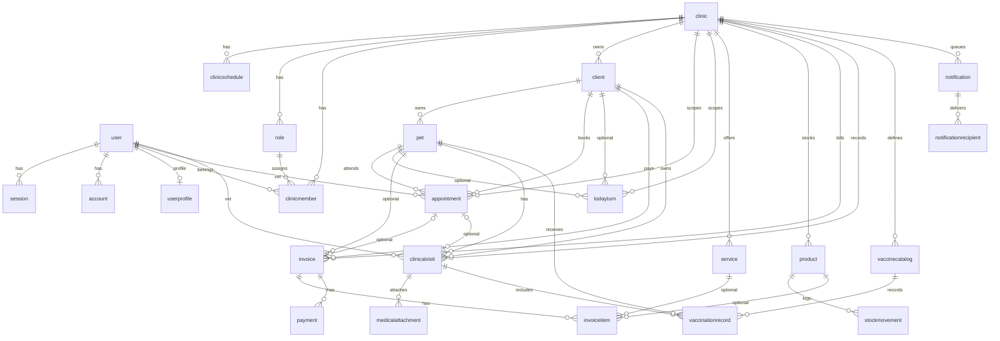

# Base de Datos y Relaciones de la Aplicacion KiskeyaVet

## Objetivo

Este documento describe el estado actual de la base de datos de la aplicacion, sus tablas, relaciones, flujo real de conexion hacia MySQL/MariaDB, reglas multi-clinica, procesos que escriben en varias tablas y detalles importantes que hoy impactan desarrollo, mantenimiento y despliegue.

La fuente principal de verdad actual es:

- `prisma/schema.prisma`
- `prisma/migrations/*`
- `src/lib/prisma.ts`
- `prisma.config.ts`
- `src/lib/auth.ts`
- `src/lib/server-auth.ts`
- `src/lib/reminders.ts`
- `src/app/api/**`
- `prisma/seed.ts`

## Stack de acceso a datos

La aplicacion usa:

- Next.js 16
- Prisma ORM 7
- `@prisma/client`
- `@prisma/adapter-mariadb`
- Better Auth con adaptador Prisma
- MySQL como provider de Prisma
- Un patron multi-tenant por `clinicId`

## Como se conecta hoy a MySQL/MariaDB

### 1. Prisma para esquema y migraciones

En `prisma/schema.prisma` el datasource esta definido como:

```prisma
datasource db {
  provider = "mysql"
}
```

No hay `url` dentro del schema. La URL para CLI se inyecta desde `prisma.config.ts`:

```ts
datasource: {
  url: process.env["DATABASE_URL"],
}
```

Eso significa:

- `prisma migrate`
- `prisma db push`
- `prisma generate`
- `prisma studio` si se usara

dependen de `DATABASE_URL`.

### 2. Prisma en runtime

La aplicacion no usa la URL completa en runtime. Usa `@prisma/adapter-mariadb` en `src/lib/prisma.ts`:

```ts
const adapter = new PrismaMariaDb({
  host: process.env.DATABASE_HOST,
  user: process.env.DATABASE_USER,
  password: process.env.DATABASE_PASSWORD,
  database: process.env.DATABASE_NAME,
  connectionLimit: 5
});
const prisma = new PrismaClient({ adapter });
```

Entonces en ejecucion la app depende de estas variables:

- `DATABASE_HOST`
- `DATABASE_USER`
- `DATABASE_PASSWORD`
- `DATABASE_NAME`

Y para comandos Prisma CLI depende de:

- `DATABASE_URL`

### 3. Implicacion tecnica importante

Hoy existen dos formas de apuntar a la base de datos:

- `DATABASE_URL` para Prisma CLI
- `DATABASE_HOST` + `DATABASE_USER` + `DATABASE_PASSWORD` + `DATABASE_NAME` para runtime

Esto implica que si esas variables no apuntan exactamente a la misma base:

- las migraciones pueden correr contra una BD
- la aplicacion puede leer/escribir en otra BD

Ese es uno de los detalles operativos mas importantes del proyecto actual.

### 4. Cliente Prisma generado

El schema genera el cliente en:

```prisma
generator client {
  provider = "prisma-client"
  output   = "../src/generated/prisma"
}
```

El `build` ejecuta:

```json
"build": "prisma generate && next build"
```

Por tanto:

- el cliente Prisma se genera antes del build
- el codigo de la app importa tipos y enums desde `src/generated/prisma`

### 5. Better Auth usa la misma conexion

`src/lib/auth.ts` conecta Better Auth al mismo cliente Prisma:

```ts
database: prismaAdapter(prisma, {
  provider: "mysql",
}),
```

En otras palabras:

- autenticacion
- sesiones
- cuentas
- verificacion
- permisos por clinica

todo sale por el mismo `PrismaClient`.

## Patron general del modelo de datos

La app esta modelada como una plataforma multi-clinica. Casi todas las tablas de negocio tienen `clinicId`, incluso cuando la clinica podria derivarse por otra relacion.

Esto se hizo para:

- filtrar rapido por clinica
- simplificar permisos
- evitar joins innecesarios para scope
- reforzar segregacion de datos entre clinicas

### Regla operativa principal

El acceso a datos de negocio casi siempre pasa por:

1. sesion autenticada
2. usuario actual
3. membresia activa en `clinicmember`
4. `clinicId` activo
5. permisos almacenados en `role.permissions`

Hay dos helpers principales:

- `getClinicIdOrFail()`
- `requireClinicPermission(permission)`

### Diferencia clave entre `user.role` y `clinicmember.roleId`

Esto es muy importante:

- `user.role` es un campo denormalizado y global
- `clinicmember.roleId` es el rol real dentro de una clinica
- `role.permissions` contiene los permisos efectivos por clinica

Actualmente:

- el sistema sincroniza `user.role` con el rol de la membresia activa cuando aplica
- `user.role` tambien sirve para roles globales como super admin
- el control real de acceso de clinica vive en `clinicmember` + `role`

## Enums del dominio

### Roles y membresia

- `ClinicRole`: `OWNER`, `ADMIN`, `VET`, `RECEPTION`
  - hoy ya no gobierna el acceso real por tabla; el control actual usa la tabla `role`

### Mascotas

- `PetSpecies`: `DOG`, `CAT`, `BIRD`, `RABBIT`, `OTHER`
- `PetSex`: `MALE`, `FEMALE`, `UNKNOWN`

### Agenda

- `AppointmentStatus`: `SCHEDULED`, `CONFIRMED`, `IN_PROGRESS`, `COMPLETED`, `CANCELLED`, `NO_SHOW`
- `AppointmentType`: `CONSULTATION`, `VACCINATION`, `SURGERY`, `AESTHETIC`, `CHECKUP`, `EMERGENCY`, `GROOMING`, `BATH`, `HOSPITALIZATION`, `DEWORMING`, `OTHER`
- `TodayTurnStatus`: `WAITING`, `IN_PROGRESS`, `READY`, `DELIVERED`, `CANCELLED`
- `Weekday`: `monday` a `sunday`

### Facturacion e inventario

- `InvoiceStatus`: `DRAFT`, `ISSUED`, `PAID`, `PARTIALLY_PAID`, `VOID`
- `InvoiceItemType`: `SERVICE`, `PRODUCT`, `CUSTOM`
- `PaymentMethod`: `CASH`, `CARD`, `TRANSFER`, `OTHER`
- `StockMovementType`: `IN`, `OUT`, `ADJUST`, `SALE`, `PURCHASE`, `EXPIRED`

### Notificaciones

- `NotificationChannel`: `IN_APP`, `EMAIL`, `SMS`, `WHATSAPP`
- `NotificationStatus`: `QUEUED`, `SENT`, `FAILED`, `CANCELLED`

### Vacunas

- `VaccineIntervalUnit`: `DAYS`, `WEEKS`, `MONTHS`, `YEARS`

### Suscripcion

- `SubscriptionStatus`: `ACTIVE`, `INACTIVE`, `PAST_DUE`

## Mapa de tablas actuales

### Tablas de autenticacion y cuenta

### `user` (`model User`)

Proposito:

- usuario base del sistema
- autenticacion
- autorias
- veterinarios
- empleados
- administradores

PK:

- `id` string

Campos clave:

- `name`
- `email` unique
- `emailVerified`
- `image`
- `role`
- `banned`
- `banReason`
- `banExpires`
- `createdAt`
- `updatedAt`

Relaciones:

- 1:N con `account`
- 1:N con `session`
- 1:1 opcional con `userprofile`
- 1:N con `clinicmember`
- 1:N con `appointment` por `vetId`
- 1:N con `clinicalvisit` por `vetId`
- 1:N con `invoice` por `createdById`
- 1:N con `payment` por `createdById`
- 1:N con `stockmovement` por `createdById`
- 1:N con `notification` por `createdById`
- 1:N con `notificationrecipient`
- 1:N con `employeeinvite` como creador
- 1:N con `employeeinvite` como usuario invitado
- 1:N con `pushsubscription`

Observacion importante:

- `user.role` no es suficiente para resolver permisos de clinica

### `userprofile` (`model UserProfile`)

Proposito:

- extension 1:1 del usuario con datos de perfil

PK:

- `id` int autoincrement

Restricciones:

- `userId` unique

Campos clave:

- `phone`
- `jobTitle`
- `bio`

Relacion:

- N:1 hacia `user` con `onDelete: Cascade`

### `session` (`model Session`)

Proposito:

- sesiones activas de Better Auth

PK:

- `id` string

Campos clave:

- `token` unique
- `expiresAt`
- `ipAddress`
- `userAgent`
- `impersonatedBy`
- `userId`

Relacion:

- N:1 hacia `user`

### `account` (`model Account`)

Proposito:

- credenciales/cuentas autenticables de Better Auth

PK:

- `id` string

Campos clave:

- `accountId`
- `providerId`
- `userId`
- `accessToken`
- `refreshToken`
- `idToken`
- `password`

Relacion:

- N:1 hacia `user`

### `verification` (`model Verification`)

Proposito:

- tokens de verificacion de Better Auth
- hoy tambien se reutiliza para confirmacion de citas

PK:

- `id` string

Campos clave:

- `identifier`
- `value`
- `expiresAt`

Uso importante actual:

- el recordatorio de cita crea tokens con prefijo `appointment-confirmation:`
- `value` guarda el `appointmentId`
- al confirmar la cita se cambia `appointment.status` a `CONFIRMED` y se borra el token

### Tablas de clinica, permisos y organizacion

### `clinic` (`model Clinic`)

Proposito:

- entidad principal tenant

PK:

- `id` int autoincrement

Campos clave:

- identidad: `name`, `phone`, `email`, `address`, `currency`, `timezone`
- branding: `logoUrl`, `slogan`, `website`
- contacto/negocio: `owner`, `mobile`
- fiscales: `taxName`, `taxId`
- bancarios: `bankName`, `bankAccount`, `bankClabe`
- factura: `invoiceNotes`, `invoiceTerms`
- redes: `socialMedia` JSON
- admin/suscripcion: `isActive`, `subscriptionStatus`, `subscriptionEndDate`, `plan`
- auditoria: `createdAt`, `updatedAt`

Relaciones:

- 1:N con `clinicschedule`
- 1:N con `clinicmember`
- 1:N con `role`
- 1:N con `employeeinvite`
- 1:N con `client`
- 1:N con `pet`
- 1:N con `appointment`
- 1:N con `todayturn`
- 1:N con `service`
- 1:N con `product`
- 1:N con `stockmovement`
- 1:N con `invoice`
- 1:N con `clinicalvisit`
- 1:N con `medicalattachment`
- 1:N con `vaccinecatalog`
- 1:N con `vaccinationrecord`
- 1:N con `notification`
- 1:N con `pushsubscription`

Observacion:

- `clinicId` se replica en casi todas las tablas para scope directo

### `clinicschedule` (`model ClinicSchedule`)

Proposito:

- horario de apertura por dia de la semana

PK:

- `id` int autoincrement

Restricciones:

- unique (`clinicId`, `day`)

Campos clave:

- `day`
- `open`
- `close`
- `closed`

Relacion:

- N:1 hacia `clinic`

Uso actual:

- la API de citas valida contra este horario antes de crear o actualizar una cita
- el perfil de clinica lo mantiene con `upsert` por dia

### `role` (`model Role`)

Proposito:

- roles por clinica, no globales

PK:

- `id` int autoincrement

Restricciones:

- unique (`clinicId`, `key`)

Campos clave:

- `key`
- `name`
- `description`
- `permissions` JSON
- `isActive`
- `isSystem`

Relacion:

- N:1 hacia `clinic`
- 1:N con `clinicmember`
- 1:N con `employeeinvite`

Detalle importante:

- los permisos reales viven en `permissions` JSON
- ejemplos: `appointments.read`, `inventory.update`, `roles.manage`

### `clinicmember` (`model ClinicMember`)

Proposito:

- membresia de un usuario dentro de una clinica

PK:

- `id` int autoincrement

Restricciones:

- unique (`clinicId`, `userId`)

Campos clave:

- `clinicId`
- `userId`
- `roleId`
- `isActive`
- `createdAt`
- `updatedAt`

Relacion:

- N:1 hacia `clinic`
- N:1 hacia `user`
- N:1 hacia `role`

Detalle operativo:

- esta tabla define la clinica activa que usa la mayoria de endpoints
- si un usuario entra con un email invitado pendiente, el sistema puede activar automaticamente esta membresia

### `employeeinvite` (`model EmployeeInvite`)

Proposito:

- invitaciones a empleados para unirse a una clinica

PK:

- `id` int autoincrement

Restricciones:

- `tokenHash` unique

Campos clave:

- `clinicId`
- `email`
- `roleId`
- `userId` opcional
- `tokenHash`
- `expiresAt`
- `acceptedAt`
- `createdById`
- `createdAt`

Relaciones:

- N:1 hacia `clinic`
- N:1 hacia `role`
- N:1 opcional hacia `user` como invitado
- N:1 opcional hacia `user` como creador

Flujo actual:

- al aceptar invitacion se hace `upsert` en `clinicmember`
- se marca `acceptedAt`
- se sincroniza `user.role`

### `pushsubscription` (`model PushSubscription`)

Proposito:

- suscripcion web push

PK:

- `id` int autoincrement

Restricciones:

- unique (`clinicId`)

Campos clave:

- `clinicId`
- `userId`
- `endpoint`
- `p256dh`
- `auth`
- `userAgent`
- `createdAt`
- `updatedAt`

Relaciones:

- N:1 hacia `clinic`
- N:1 opcional hacia `user`

Detalle muy importante:

- hoy el modelo permite solo una suscripcion por clinica
- la API hace `upsert` por `clinicId`
- eso significa que no se guardan multiples dispositivos por clinica ni una suscripcion por usuario/dispositivo

### Clientes y mascotas

### `client` (`model Client`)

Proposito:

- propietario/cliente de la clinica

PK:

- `id` int autoincrement

Campos clave:

- `clinicId`
- `fullName`
- `phone`
- `email`
- `address`
- `notes`
- `createdAt`
- `updatedAt`

Relaciones:

- N:1 hacia `clinic`
- 1:N con `pet`
- 1:N con `appointment`
- 1:N con `todayturn`
- 1:N con `invoice`
- 1:N con `clinicalvisit`
- 1:N con `notificationrecipient`

Indices utiles:

- por `clinicId`
- por `clinicId + fullName`
- por `clinicId + phone`
- por `clinicId + email`

Detalle operativo:

- existe el concepto de cliente especial `VENTA GENERAL` para ventas walk-in en POS/facturas sin cliente formal

### `pet` (`model Pet`)

Proposito:

- mascota del cliente

PK:

- `id` int autoincrement

Restricciones:

- unique (`clinicId`, `microchip`)

Campos clave:

- `clinicId`
- `clientId`
- `name`
- `species`
- `breed`
- `sex`
- `color`
- `birthDate`
- `microchip`
- `weightKg`
- `notes`
- `createdAt`
- `updatedAt`

Relaciones:

- N:1 hacia `clinic`
- N:1 hacia `client`
- 1:N con `appointment`
- 1:N con `todayturn`
- 1:N con `clinicalvisit`
- 1:N con `vaccinationrecord`
- 1:N con `invoice`

Regla de negocio actual:

- la API valida que la mascota pertenezca al cliente antes de crear o actualizar citas y turnos enlazados

### Agenda y atencion diaria

### `appointment` (`model Appointment`)

Proposito:

- cita programada

PK:

- `id` int autoincrement

Campos clave:

- `clinicId`
- `clientId`
- `petId`
- `type`
- `startAt`
- `endAt`
- `status`
- `reason`
- `notes`
- `reminderSent`
- `reminderSentAt`
- `vetId`
- `createdAt`
- `updatedAt`

Relaciones:

- N:1 hacia `clinic`
- N:1 hacia `client`
- N:1 hacia `pet`
- N:1 opcional hacia `user` como veterinario
- 1:1 opcional con `clinicalvisit`
- 1:1 opcional con `invoice`

Restriccion muy importante:

- `invoice.appointmentId` es unique
- `clinicalvisit.appointmentId` es unique
- en la practica una cita puede tener como maximo:
  - una visita clinica enlazada
  - una factura enlazada

Comportamiento actual:

- la colision de horarios se valida en aplicacion, no con constraint SQL
- tambien se valida contra `clinicschedule`
- al crear, actualizar o cambiar estado, se resincronizan recordatorios
- si se reprograma, se resetean `reminderSent` y `reminderSentAt`

### `todayturn` (`model TodayTurn`)

Proposito:

- turnos del dia para atencion rapida, grooming o walk-ins

PK:

- `id` int autoincrement

Campos clave:

- `clinicId`
- `clientId` opcional
- `petId` opcional
- `petName`
- `species`
- `ownerName`
- `ownerPhone`
- `type`
- `serviceName`
- `notes`
- `arrivalAt`
- `estimatedDurationMins`
- `status`
- `notifiedAt`
- `createdAt`
- `updatedAt`

Relaciones:

- N:1 hacia `clinic`
- N:1 opcional hacia `client`
- N:1 opcional hacia `pet`

Detalle de diseño importante:

- aunque `clientId` y `petId` existan, la tabla guarda una copia denormalizada de `petName`, `species`, `ownerName`, `ownerPhone`
- esto permite soportar walk-ins y tambien congelar el snapshot operativo del turno

Detalle funcional:

- no existe FK desde `todayturn` hacia `invoice`
- cuando se crea una factura desde un turno, la app solo actualiza `todayturn.status = DELIVERED`

### Servicios, productos, inventario y facturacion

### `service` (`model Service`)

Proposito:

- catalogo de servicios por clinica

PK:

- `id` int autoincrement

Restricciones:

- unique (`clinicId`, `name`)

Campos clave:

- `clinicId`
- `name`
- `category`
- `description`
- `durationMins`
- `price`
- `isActive`
- `createdAt`
- `updatedAt`

Relaciones:

- N:1 hacia `clinic`
- 1:N con `invoiceitem`

### `product` (`model Product`)

Proposito:

- catalogo de productos e inventario

PK:

- `id` int autoincrement

Restricciones:

- unique (`clinicId`, `sku`)

Campos clave:

- `clinicId`
- `sku`
- `name`
- `category`
- `unit`
- `cost`
- `price`
- `trackStock`
- `stockOnHand`
- `minStock`
- `isActive`
- `description`
- `requiresPrescription`
- `createdAt`
- `updatedAt`

Relaciones:

- N:1 hacia `clinic`
- 1:N con `stockmovement`
- 1:N con `invoiceitem`

Detalle operativo:

- si `trackStock = false`, la API de movimientos manuales rechaza movimientos

### `stockmovement` (`model StockMovement`)

Proposito:

- kardex/log de cambios de inventario

PK:

- `id` int autoincrement

Campos clave:

- `clinicId`
- `productId`
- `type`
- `quantity`
- `reason`
- `referenceType`
- `referenceId`
- `createdById`
- `createdAt`

Relaciones:

- N:1 hacia `clinic`
- N:1 hacia `product`
- N:1 opcional hacia `user` como creador

Comportamiento actual:

- los movimientos manuales actualizan `product.stockOnHand` dentro de una transaccion
- la API calcula delta segun `type`
- no permite que el stock quede negativo
- la creacion de factura con items de producto tambien descuenta stock y crea movimientos `OUT`

### `invoice` (`model Invoice`)

Proposito:

- factura/cobro

PK:

- `id` int autoincrement

Restricciones:

- unique (`appointmentId`)
- unique (`clinicId`, `number`)

Campos clave:

- `clinicId`
- `clientId`
- `petId` opcional
- `appointmentId` opcional
- `number`
- `status`
- `issueDate`
- `dueDate`
- `paidAt`
- `subtotal`
- `tax`
- `discount`
- `total`
- `notes`
- `createdById`
- `createdAt`
- `updatedAt`

Relaciones:

- N:1 hacia `clinic`
- N:1 hacia `client`
- N:1 opcional hacia `pet`
- 1:1 opcional hacia `appointment`
- N:1 opcional hacia `user` como creador
- 1:N con `invoiceitem`
- 1:N con `payment`

Comportamiento actual:

- el numero se genera por clinica y por dia con formato `FAC-YYYYMMDD-####`
- la BD protege unicidad final con `unique (clinicId, number)`
- al crear factura desde una cita, la app marca la cita como `COMPLETED`
- al crear factura desde un turno del dia, la app marca el turno como `DELIVERED`

### `invoiceitem` (`model InvoiceItem`)

Proposito:

- lineas de detalle de la factura

PK:

- `id` int autoincrement

Campos clave:

- `invoiceId`
- `type`
- `serviceId` opcional
- `productId` opcional
- `description`
- `quantity`
- `unitPrice`
- `taxRate`
- `lineTotal`
- `createdAt`

Relaciones:

- N:1 hacia `invoice`
- N:1 opcional hacia `service`
- N:1 opcional hacia `product`

Detalle importante:

- `SERVICE` requiere `serviceId`
- `PRODUCT` requiere `productId`
- `CUSTOM` no apunta a catalogo

### `payment` (`model Payment`)

Proposito:

- pagos aplicados a una factura

PK:

- `id` int autoincrement

Campos clave:

- `invoiceId`
- `amount`
- `method`
- `reference`
- `paidAt`
- `createdById`

Relaciones:

- N:1 hacia `invoice`
- N:1 opcional hacia `user` como creador

Comportamiento actual:

- la ruta de pagos suma todos los pagos y si alcanza el total marca `invoice.status = PAID`
- si no alcanza el total, esa ruta no cambia explicitamente el estado a `PARTIALLY_PAID`
- por lo tanto una factura que reciba pagos parciales despues de creada puede quedarse en `ISSUED` hasta completarse

### Historial clinico y vacunas

### `clinicalvisit` (`model ClinicalVisit`)

Proposito:

- visita/consulta clinica

PK:

- `id` int autoincrement

Restricciones:

- unique (`appointmentId`)

Campos clave:

- `clinicId`
- `clientId`
- `petId`
- `appointmentId` opcional
- `vetId` opcional
- `visitAt`
- `weightKg`
- `temperatureC`
- `diagnosis`
- `treatment`
- `notes`
- `createdAt`
- `updatedAt`

Relaciones:

- N:1 hacia `clinic`
- N:1 hacia `client`
- N:1 hacia `pet`
- N:1 opcional hacia `appointment`
- N:1 opcional hacia `user` como veterinario
- 1:N con `medicalattachment`
- 1:N con `vaccinationrecord`

Detalle operativo:

- la ruta manual de crear visita usa el `clientId` derivado desde la mascota
- los adjuntos no se crean dentro del POST de visita; se manejan en rutas separadas

### `medicalattachment` (`model MedicalAttachment`)

Proposito:

- archivos adjuntos de una visita clinica

PK:

- `id` int autoincrement

Campos clave:

- `clinicId`
- `visitId`
- `fileName`
- `fileType`
- `url`
- `createdAt`

Relaciones:

- N:1 hacia `clinic`
- N:1 hacia `clinicalvisit`

Detalle muy importante:

- `url` no necesariamente es una URL publica
- hoy normalmente guarda una referencia S3 tipo `s3://...`
- la app la resuelve a signed URLs al leer

### `vaccinecatalog` (`model VaccineCatalog`)

Proposito:

- catalogo de vacunas por clinica

PK:

- `id` int autoincrement

Restricciones:

- unique (`clinicId`, `name`)

Campos clave:

- `clinicId`
- `name`
- `species`
- `intervalValue`
- `intervalUnit`
- `notes`
- `isActive`
- `createdAt`
- `updatedAt`

Relaciones:

- N:1 hacia `clinic`
- 1:N con `vaccinationrecord`

### `vaccinationrecord` (`model VaccinationRecord`)

Proposito:

- aplicacion real de una vacuna a una mascota

PK:

- `id` int autoincrement

Campos clave:

- `clinicId`
- `petId`
- `vaccineId`
- `visitId` opcional
- `appliedAt`
- `nextDueAt`
- `batchNumber`
- `notes`
- `createdAt`

Relaciones:

- N:1 hacia `clinic`
- N:1 hacia `pet`
- N:1 hacia `vaccinecatalog`
- N:1 opcional hacia `clinicalvisit`

Detalle operativo:

- el modelo soporta vacuna ligada a visita
- la ruta manual de vacunacion por mascota hoy crea el registro sin enlazar `visitId`
- el seed si demuestra el escenario de vacunacion enlazada a una visita

### Notificaciones

### `notification` (`model Notification`)

Proposito:

- log y cola de notificaciones

PK:

- `id` int autoincrement

Campos clave:

- `clinicId`
- `channel`
- `status`
- `title`
- `message`
- `scheduledAt`
- `sentAt`
- `error`
- `meta` JSON
- `createdById`
- `createdAt`

Relaciones:

- N:1 hacia `clinic`
- N:1 opcional hacia `user` como creador
- 1:N con `notificationrecipient`

Uso actual muy importante:

- recordatorios de citas
- recordatorios de pago
- cola pendiente (`QUEUED`)
- resultado final (`SENT`, `FAILED`, `CANCELLED`)

### `notificationrecipient` (`model NotificationRecipient`)

Proposito:

- destinatario real de una notificacion

PK:

- `id` int autoincrement

Campos clave:

- `notificationId`
- `userId` opcional
- `clientId` opcional
- `email`
- `phone`
- `status`
- `sentAt`
- `error`

Relaciones:

- N:1 hacia `notification`
- N:1 opcional hacia `user`
- N:1 opcional hacia `client`

Detalle importante:

- una notificacion puede apuntar a entidades (`userId`, `clientId`) y ademas guardar email/telefono concretos
- esto permite snapshot del destinatario aunque luego cambien sus datos

## Relaciones mas importantes del sistema

### Relaciones 1:N principales

- `clinic -> clients`
- `clinic -> pets`
- `clinic -> appointments`
- `clinic -> todayTurns`
- `clinic -> services`
- `clinic -> products`
- `clinic -> invoices`
- `clinic -> visits`
- `clinic -> vaccines`
- `clinic -> notifications`
- `client -> pets`
- `client -> appointments`
- `client -> invoices`
- `pet -> appointments`
- `pet -> visits`
- `pet -> vaccinations`
- `invoice -> items`
- `invoice -> payments`
- `visit -> attachments`
- `visit -> vaccinations`
- `notification -> recipients`

### Relaciones 1:1 importantes

- `user -> userprofile` opcional
- `appointment -> invoice` opcional por `invoice.appointmentId unique`
- `appointment -> clinicalvisit` opcional por `clinicalvisit.appointmentId unique`

### Relaciones con `SetNull`

Cuando la entidad referida puede desaparecer sin destruir el registro historico:

- `appointment.vetId -> user`
- `todayturn.clientId -> client`
- `todayturn.petId -> pet`
- `invoice.petId -> pet`
- `invoice.appointmentId -> appointment`
- `invoiceitem.serviceId -> service`
- `invoiceitem.productId -> product`
- `payment.createdById -> user`
- `clinicalvisit.appointmentId -> appointment`
- `clinicalvisit.vetId -> user`
- `vaccinationrecord.visitId -> clinicalvisit`
- `notification.createdById -> user`
- `notificationrecipient.userId -> user`
- `notificationrecipient.clientId -> client`
- `pushsubscription.userId -> user`
- `employeeinvite.userId -> user`
- `employeeinvite.createdById -> user`

### Relaciones con `Cascade`

Cuando se elimina el padre, se eliminan los hijos:

- `clinic` elimina practicamente todo el dominio asociado
- `client` elimina `pet`, `appointment`, `invoice`, `clinicalvisit` segun sus FKs correspondientes
- `pet` elimina visitas/vacunaciones/citas relacionadas
- `invoice` elimina items y pagos
- `clinicalvisit` elimina attachments
- `notification` elimina recipients
- `user` elimina `session`, `account`, `userprofile` y membresias

## Diagrama conceptual resumido



## Flujos reales actuales que tocan varias tablas

### Alta de clinica desde administracion

`src/lib/admin-clinics.ts` crea en una transaccion:

- `clinic`
- roles por defecto en `role`
- horario por defecto en `clinicschedule`
- `user` owner
- `account` credential del owner
- opcional `userprofile`
- `clinicmember` del owner

Este es el flujo oficial de provisionamiento inicial.

### Login, sesion y resolucion de clinica activa

El flujo operativo es:

1. Better Auth resuelve la sesion
2. se obtiene `session.user.id`
3. se busca membresia activa en `clinicmember`
4. si no existe y el email tiene invitacion pendiente, se intenta activar automaticamente
5. se valida que la clinica este activa
6. se consultan permisos desde `role.permissions`

### Creacion de cita

La API de citas:

- valida Zod
- valida horario contra `clinicschedule`
- valida consistencia `pet -> client`
- valida que `vetId` pertenezca a la clinica y tenga rol `vet`
- detecta solapamiento en aplicacion
- inserta `appointment`
- genera/sincroniza recordatorios en `notification` y `notificationrecipient`
- si el estado es `SCHEDULED`, genera token en `verification`

### Actualizacion o cambio de estado de cita

La app:

- actualiza `appointment`
- si hay cambios de fecha/hora/tipo/paciente, resetea flags de recordatorio
- resincroniza recordatorios
- al borrar cita, cancela notificaciones pendientes y elimina tokens de confirmacion

### Turnos del dia

La API soporta dos escenarios:

- turno enlazado a cliente y mascota existentes
- walk-in sin cliente/mascota persistidos

En ambos casos inserta:

- `todayturn`

pero en el caso enlazado tambien copia a columnas denormalizadas:

- `petName`
- `species`
- `ownerName`
- `ownerPhone`

### Creacion de factura

La API de facturas hace en una transaccion:

- genera `invoice.number`
- inserta `invoice`
- inserta `invoiceitem`
- opcionalmente inserta `payment` si `payNow = true`
- por cada item de producto:
  - baja `product.stockOnHand`
  - crea `stockmovement`
- si viene `appointmentId`, marca `appointment.status = COMPLETED`
- si viene `todayTurnId`, marca `todayturn.status = DELIVERED`

Despues de la transaccion:

- sincroniza recordatorios de pago en `notification` y `notificationrecipient`

### Edicion de factura

La API de update de factura:

- puede borrar y recrear todos los `invoiceitem`
- recalcula totales
- actualiza `invoice`

Detalle importante actual:

- esta edicion no recompone ni revierte stock historico de productos ya descontados al facturar

### Registro manual de pago

La API de pagos:

- crea `payment`
- recalcula suma de pagos de la factura
- si la suma alcanza el total, marca `invoice.status = PAID` y `paidAt`

Detalle importante actual:

- si la suma no alcanza el total, no fuerza `PARTIALLY_PAID`

### Movimiento manual de stock

La API de stock:

- valida `product.trackStock`
- calcula delta segun el tipo
- rechaza stock negativo
- actualiza `product.stockOnHand`
- crea `stockmovement`

Todo eso ocurre dentro de una transaccion.

### Visitas clinicas

La API de visitas:

- valida mascota dentro de la clinica
- deriva `clientId` desde `pet.clientId`
- crea `clinicalvisit`

Los adjuntos:

- no se guardan dentro del POST de visita
- se manejan por rutas separadas sobre `medicalattachment`

### Vacunaciones

La API de vacunaciones por mascota:

- valida la mascota
- crea `vaccinationrecord`

Detalle actual:

- esta ruta no enlaza automaticamente `visitId`
- la tabla soporta ambos modelos: con visita o sin visita

### Recordatorios y cola de notificaciones

`src/lib/reminders.ts` maneja:

- generacion de recordatorios de cita
- generacion de recordatorios de pago
- cancelacion de notificaciones pendientes
- envio de cola
- actualizacion de estados `QUEUED/SENT/FAILED/CANCELLED`

Tablas implicadas:

- `notification`
- `notificationrecipient`
- `verification`
- `appointment`

### Archivos y storage

La BD no guarda binarios.

Hoy guarda referencias y metadata:

- `clinic.logoUrl`
- `user.image`
- `medicalattachment.url`

Estas referencias suelen ser `s3://...` y luego:

- se generan signed upload URLs
- se resuelven signed read URLs
- se eliminan objetos por `storageRef`

Ademas:

- los adjuntos medicos se validan contra `clinicalvisit` y `clinicId` antes de firmar la subida

## Seed actual

`prisma/seed.ts` hace mucho mas que poblar usuarios.

Actualmente crea y relaciona:

- superadmin
- clinicas demo
- roles
- horarios
- usuarios
- membresias
- invitaciones
- servicios
- productos
- movimientos de stock
- vacunas
- clientes
- mascotas
- citas
- visitas
- attachments
- registros de vacunacion
- facturas
- pagos
- turnos del dia
- notificaciones
- push subscriptions

Tambien usa transacciones y limpia datos de ciertas clinicas demo antes de recrearlos.

## Cronologia de migraciones

### 2026-01-11 - `20260111213402_migrate_better_auth_tables`

Creo las tablas base de auth:

- `user`
- `session`
- `account`
- `verification`

### 2026-01-13 - `20260113202628_add_product_description_prescription`

Fue la gran migracion base del dominio. Creo:

- `Clinic`
- `ClinicMember`
- `Client`
- `Pet`
- `Appointment`
- `Service`
- `Product`
- `StockMovement`
- `Invoice`
- `InvoiceItem`
- `Payment`
- `ClinicalVisit`
- `MedicalAttachment`
- `VaccineCatalog`
- `VaccinationRecord`
- `Notification`
- `NotificationRecipient`

En ese momento:

- `ClinicMember` todavia tenia columna enum `role`
- `AppointmentType` aun no tenia `BATH` ni `HOSPITALIZATION`
- `InvoiceStatus` aun no tenia `PARTIALLY_PAID`

### 2026-01-15 - `20260115151126_add_today_turns`

Agrego:

- enum ampliado de `Appointment.type`
- tabla `TodayTurn`

### 2026-01-15 - `20260115183107_add_partially_paid_to_invoice_status`

Agrego:

- `PARTIALLY_PAID` a `invoice.status`

### 2026-01-15 - `20260115195504_add_services`

Agrego:

- `service.category`
- indice por `clinicId, category`

### 2026-01-15 - `20260115204803_clinic_profile_and_schedule`

Agrego al perfil de clinica:

- `bankAccount`
- `bankClabe`
- `bankName`
- `invoiceNotes`
- `invoiceTerms`
- `logoUrl`
- `mobile`
- `owner`
- `slogan`
- `socialMedia` JSON
- `taxId`
- `taxName`
- `website`

Tambien creo:

- `ClinicSchedule`

### 2026-01-16 - `20260116005239_add_push_subscriptions`

Creo:

- `PushSubscription`

con unique actual por `clinicId`.

### 2026-01-17 - `20260117201001_add_admin_better_auth_plugin`

Fue la refactor mas importante del modelo de permisos. Agrego:

- `Role`
- `EmployeeInvite`
- `session.impersonatedBy`
- `user.banExpires`
- `user.banReason`
- `user.banned`
- `user.role`

Y cambio:

- `clinicmember` deja de usar columna enum `role`
- `clinicmember` pasa a usar `roleId`

### 2026-04-08 - `20260408202000_add_user_profile`

Creo:

- `userprofile`

### 2026-04-09 - `20260409160000_add_appointment_reminder_flags`

Agrego en `appointment`:

- `reminderSent`
- `reminderSentAt`

### 2026-04-11 - `20260411113000_add_clinic_subscription_admin_controls`

Agrego en `clinic`:

- `isActive`
- `subscriptionStatus`
- `subscriptionEndDate`
- `plan`

Tambien creo indice de administracion sobre suscripcion.

## Observaciones tecnicas importantes del estado actual

### 1. Mezcla de nombres de tabla en mayuscula/minuscula

Las migraciones viejas crean tablas como:

- `Clinic`
- `Client`
- `Appointment`

Pero el schema actual usa `@@map` a minusculas:

- `clinic`
- `client`
- `appointment`

Y migraciones posteriores ya alteran tablas en minuscula:

- `ALTER TABLE clinic`
- `ALTER TABLE appointment`

Esto hoy puede funcionar en entornos MySQL/MariaDB case-insensitive, pero es un detalle delicado para despliegues en Linux o configuraciones estrictas de nombres de tabla.

### 2. `clinicId` esta duplicado intencionalmente

Aunque algunas relaciones permitirian derivar la clinica indirectamente, se repite `clinicId` en muchas tablas para:

- performance
- permisos
- filtros simples
- aislamiento de tenant

### 3. `createdById` existe, pero no siempre se llena

El schema soporta autoria en:

- `invoice`
- `payment`
- `stockmovement`
- `notification`

Sin embargo hoy:

- `stockmovement` manual si intenta guardar usuario
- varias rutas de factura/pago crean registros con `createdById = null`
- `createQueuedNotification()` tampoco asigna `createdById`

### 4. Los recordatorios viven en base de datos

No son solo eventos en memoria.

Se persisten en:

- `notification`
- `notificationrecipient`
- `verification`

Por eso la BD es parte del scheduler funcional de la app.

### 5. El numero de factura se calcula en aplicacion

La secuencia:

- se busca la ultima factura del dia por clinica
- se calcula el siguiente correlativo
- la BD refuerza con unique (`clinicId`, `number`)

La unicidad fuerte esta en la base; la secuencia visible se arma en la capa de aplicacion.

### 6. Las colisiones de citas no se resuelven con constraint SQL

La aplicacion:

- busca candidatas cercanas
- calcula overlap
- rechaza si se pisan

Eso significa que la integridad de agenda depende de logica de aplicacion, no de una constraint nativa en la base.

### 7. Los archivos se modelan como referencias, no blobs

Especialmente:

- `medicalattachment.url`
- `clinic.logoUrl`
- `user.image`

La BD guarda el puntero; el archivo real esta fuera, normalmente en S3 compatible.

### 8. `TodayTurn` no esta integrado por FK con `Invoice`

Hoy la relacion es funcional, no relacional:

- se pasa `todayTurnId` al crear factura
- la factura no guarda ese `todayTurnId`
- solo se actualiza el estado del turno

### 9. `user.role` y `role.key` pueden convivir

El sistema mezcla:

- rol global del usuario
- rol efectivo dentro de una clinica

Esto es correcto para soporte multi-tenant, pero conviene recordar que no son equivalentes.

## Resumen corto del modelo

Si hubiera que resumir la base actual en una sola frase:

KiskeyaVet es una app multi-clinica donde `clinic` es el tenant, `clinicmember + role` resuelven permisos, `client/pet/appointment/todayturn` cubren operacion diaria, `invoice/invoiceitem/payment/product/stockmovement` cubren caja e inventario, `clinicalvisit/medicalattachment/vaccinecatalog/vaccinationrecord` cubren el expediente medico, y `notification/notificationrecipient/verification` sostienen el sistema real de recordatorios y confirmaciones.

## Archivos clave para futuras modificaciones

- `prisma/schema.prisma`
- `prisma.config.ts`
- `src/lib/prisma.ts`
- `src/lib/auth.ts`
- `src/lib/server-auth.ts`
- `src/lib/reminders.ts`
- `src/lib/admin-clinics.ts`
- `src/lib/current-user-profile.ts`
- `src/lib/employee-invites.ts`
- `src/app/api/appointments/route.ts`
- `src/app/api/appointments/[id]/route.ts`
- `src/app/api/invoices/route.ts`
- `src/app/api/invoices/[id]/route.ts`
- `src/app/api/invoices/[id]/payments/route.ts`
- `src/app/api/stock-movements/route.ts`
- `src/app/api/clinic-profile/route.ts`
- `src/app/api/pets/[id]/visits/route.ts`
- `src/app/api/pets/[id]/vaccinations/route.ts`
- `src/lib/storage.ts`
- `prisma/seed.ts`
